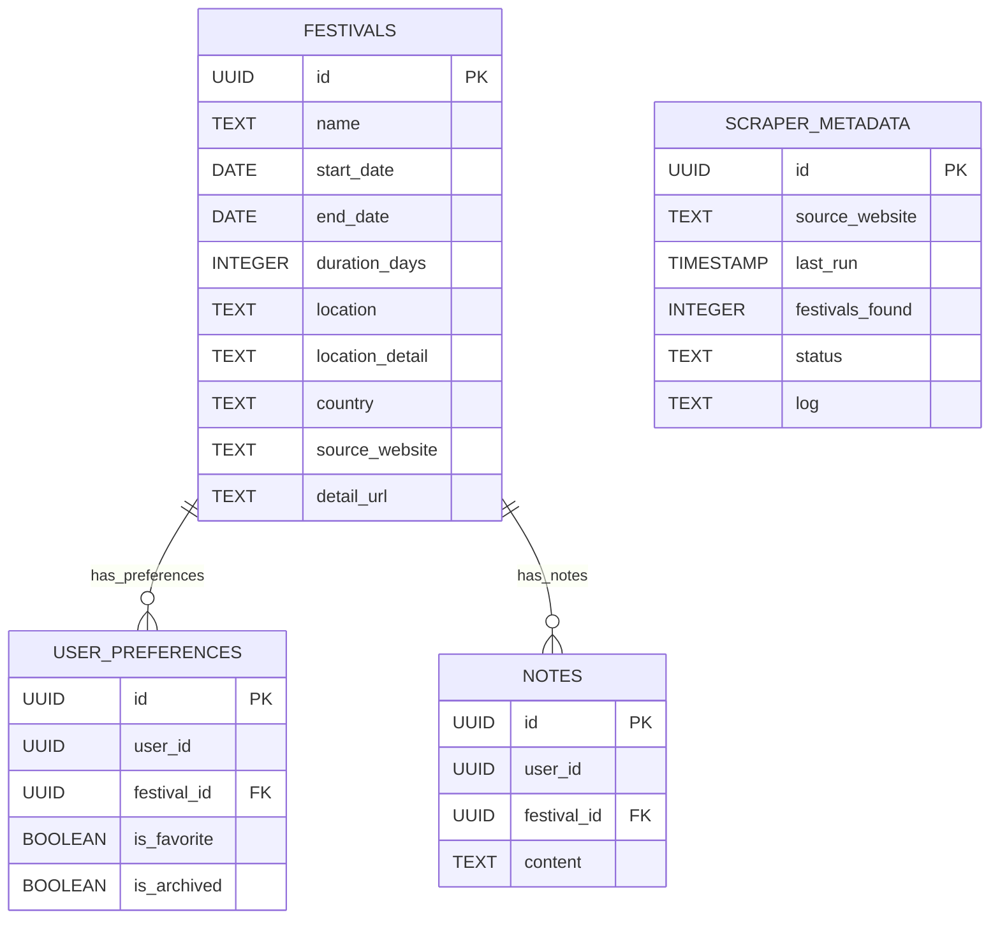

# FestiFind - Database Schema

This document outlines the database schema for the FestiFind application, designed to store festival data, user preferences, and system metadata.

## Overview

The database will be implemented in Supabase, which provides a PostgreSQL database with real-time capabilities. The schema includes tables for festivals, user preferences, notes, and scraper metadata.

## Tables

### Festivals

This table stores the core festival information from all sources.

```sql
CREATE TABLE festivals (
  id UUID PRIMARY KEY DEFAULT uuid_generate_v4(),
  name TEXT NOT NULL,
  start_date DATE NOT NULL,
  end_date DATE,
  duration_days INTEGER,
  location TEXT,
  location_detail TEXT,
  country TEXT,
  source_website TEXT NOT NULL,
  detail_url TEXT,
  created_at TIMESTAMP WITH TIME ZONE DEFAULT NOW(),
  updated_at TIMESTAMP WITH TIME ZONE DEFAULT NOW()
);

-- Index for faster date-based filtering
CREATE INDEX idx_festivals_start_date ON festivals(start_date);
-- Index for quicker source filtering
CREATE INDEX idx_festivals_source ON festivals(source_website);
```

**Fields explanation:**
- `id`: Unique identifier for each festival
- `name`: Name of the festival
- `start_date`: Start date of the festival
- `end_date`: End date of the festival (if multi-day)
- `duration_days`: Duration in days (calculated)
- `location`: Primary location (city/venue)
- `location_detail`: Additional location details
- `country`: Country where the festival takes place
- `source_website`: The website from which this data was scraped
- `detail_url`: URL to the original festival page
- `created_at`: Timestamp when record was created
- `updated_at`: Timestamp when record was last updated

### User Preferences

This table stores user-specific preferences for festivals.

```sql
CREATE TABLE user_preferences (
  id UUID PRIMARY KEY DEFAULT uuid_generate_v4(),
  user_id UUID NOT NULL,
  festival_id UUID NOT NULL REFERENCES festivals(id) ON DELETE CASCADE,
  is_favorite BOOLEAN DEFAULT FALSE,
  is_archived BOOLEAN DEFAULT FALSE,
  created_at TIMESTAMP WITH TIME ZONE DEFAULT NOW(),
  updated_at TIMESTAMP WITH TIME ZONE DEFAULT NOW(),
  
  -- Ensure one record per user-festival pair
  UNIQUE(user_id, festival_id)
);

-- Indexes for faster querying
CREATE INDEX idx_user_preferences_user_id ON user_preferences(user_id);
CREATE INDEX idx_user_preferences_festival_id ON user_preferences(festival_id);
CREATE INDEX idx_user_preferences_favorite ON user_preferences(is_favorite) WHERE is_favorite = TRUE;
CREATE INDEX idx_user_preferences_archived ON user_preferences(is_archived) WHERE is_archived = TRUE;
```

**Fields explanation:**
- `id`: Unique identifier for each preference record
- `user_id`: Reference to the user
- `festival_id`: Reference to the festival
- `is_favorite`: Whether the user has marked this festival as a favorite
- `is_archived`: Whether the user has archived this festival
- `created_at`: Timestamp when record was created
- `updated_at`: Timestamp when record was last updated

### Notes

This table stores user notes for festivals.

```sql
CREATE TABLE notes (
  id UUID PRIMARY KEY DEFAULT uuid_generate_v4(),
  user_id UUID NOT NULL,
  festival_id UUID NOT NULL REFERENCES festivals(id) ON DELETE CASCADE,
  content TEXT,
  created_at TIMESTAMP WITH TIME ZONE DEFAULT NOW(),
  updated_at TIMESTAMP WITH TIME ZONE DEFAULT NOW(),
  
  -- Ensure one note per user-festival pair
  UNIQUE(user_id, festival_id)
);

-- Indexes for faster querying
CREATE INDEX idx_notes_user_id ON notes(user_id);
CREATE INDEX idx_notes_festival_id ON notes(festival_id);
```

**Fields explanation:**
- `id`: Unique identifier for each note
- `user_id`: Reference to the user
- `festival_id`: Reference to the festival
- `content`: The note content
- `created_at`: Timestamp when record was created
- `updated_at`: Timestamp when record was last updated

### Scraper Metadata

This table stores metadata about scraping operations.

```sql
CREATE TABLE scraper_metadata (
  id UUID PRIMARY KEY DEFAULT uuid_generate_v4(),
  source_website TEXT NOT NULL UNIQUE,
  last_run TIMESTAMP WITH TIME ZONE,
  festivals_found INTEGER,
  status TEXT,
  log TEXT,
  created_at TIMESTAMP WITH TIME ZONE DEFAULT NOW(),
  updated_at TIMESTAMP WITH TIME ZONE DEFAULT NOW()
);
```

**Fields explanation:**
- `id`: Unique identifier for each metadata record
- `source_website`: The website that was scraped
- `last_run`: When the scraper was last run
- `festivals_found`: Number of festivals found in the last run
- `status`: Status of the last run (success, partial, failed)
- `log`: Log output from the last run
- `created_at`: Timestamp when record was created
- `updated_at`: Timestamp when record was last updated

## Row-Level Security (RLS) Policies

To ensure data security, we'll implement the following RLS policies:

```sql
-- Allow anyone to read festival data
ALTER TABLE festivals ENABLE ROW LEVEL SECURITY;
CREATE POLICY "Public festivals are viewable by everyone"
  ON festivals FOR SELECT
  USING (true);

-- User preferences are only accessible to the owning user
ALTER TABLE user_preferences ENABLE ROW LEVEL SECURITY;
CREATE POLICY "User preferences are viewable by owning user"
  ON user_preferences FOR SELECT
  USING (auth.uid() = user_id);
CREATE POLICY "User preferences are editable by owning user"
  ON user_preferences FOR INSERT WITH CHECK (auth.uid() = user_id);
CREATE POLICY "User preferences are updatable by owning user"
  ON user_preferences FOR UPDATE
  USING (auth.uid() = user_id);

-- Notes are only accessible to the owning user
ALTER TABLE notes ENABLE ROW LEVEL SECURITY;
CREATE POLICY "Notes are viewable by owning user"
  ON notes FOR SELECT
  USING (auth.uid() = user_id);
CREATE POLICY "Notes are editable by owning user"
  ON notes FOR INSERT WITH CHECK (auth.uid() = user_id);
CREATE POLICY "Notes are updatable by owning user"
  ON notes FOR UPDATE
  USING (auth.uid() = user_id);

-- Scraper metadata is only accessible to admins (to be implemented)
```

## Data Relationships



## Mock Data Setup

For initial development, we'll create mock festival data:

```sql
INSERT INTO festivals (name, start_date, end_date, duration_days, location, country, source_website, detail_url)
VALUES
('Amsterdam Dance Event', '2025-10-15', '2025-10-19', 5, 'Amsterdam', 'Netherlands', 'mock', 'https://example.com/ade'),
('Tomorrowland', '2025-07-18', '2025-07-27', 10, 'Boom', 'Belgium', 'mock', 'https://example.com/tomorrowland'),
('Glastonbury Festival', '2025-06-24', '2025-06-28', 5, 'Pilton', 'United Kingdom', 'mock', 'https://example.com/glastonbury'),
('Coachella', '2025-04-11', '2025-04-20', 10, 'Indio', 'United States', 'mock', 'https://example.com/coachella'),
('Rock Werchter', '2025-07-03', '2025-07-06', 4, 'Werchter', 'Belgium', 'mock', 'https://example.com/rockwerchter');
```

## Migration Strategy

1. Create tables in order of dependency (festivals first, then related tables)
2. Apply RLS policies
3. Insert mock data for development
4. Test queries and relationships

## Related Documents
- [Problem Statement](./problem-statement.md)
- [Technical Architecture](./technical-architecture.md)
- [Scraper Specifications](./scraper-specs.md)
- [Tasks](./tasks.md)
