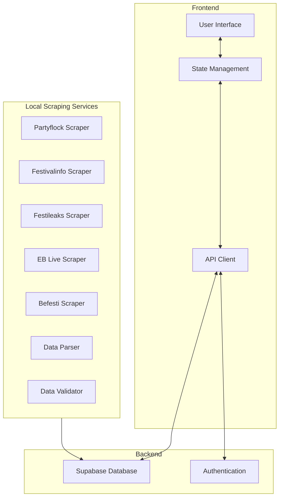

# FestiFind - Technical Architecture Document

## System Overview

FestiFind is a web application architecture designed to aggregate festival data from multiple sources, present it in a unified interface, and allow users to interact with this data through favoriting, archiving, and note-taking features.

This document outlines the high-level technical architecture for implementing this solution.



## Core Components

### 1. Frontend (v0 + React)

The frontend will be built using v0 with React and shadcn UI components to create a clean, modern Stripe-style interface.

Key frontend components:
- **Layout**: Navigation, header, footer
- **Festival Table**: Main display of festival data with sorting and filtering
- **Month Paginator**: Navigate festivals by month
- **Source Filter**: Filter festivals by source website
- **Interaction Components**: Favorite button, archive button, notes editor
- **Dev Tools Interface**: Controls for scraping process and data management

### 2. Database (Supabase)

Supabase will provide the database layer with PostgreSQL for storing:
- Festival data
- User preferences (favorites, archives)
- User notes
- Authentication data

### 3. Local Scraping Services

Each source website will have its own dedicated scraper module that runs locally:
- **HTML Downloader**: Fetches the HTML from the target website
- **Parser**: Extracts relevant festival data from the HTML
- **Validator**: Ensures data quality and format consistency
- **Uploader**: Sends validated data to the Supabase database

### 4. Authentication

Authentication will be implemented using Supabase Auth to:
- Secure user data
- Personalize the user experience
- Protect admin/dev tools

## Data Flow

1. **Initial Setup**:
   - Frontend is deployed with mock festival data
   - Database tables are created in Supabase
   - Authentication is configured

2. **Scraping Process**:
   - Admin initiates scraping through the dev tools interface
   - Scraper downloads HTML files locally
   - Parser extracts festival data from HTML
   - Validator checks data quality
   - Admin reviews data in the dev tools interface
   - Validated data is uploaded to Supabase

3. **User Interaction**:
   - User logs in via authentication
   - Frontend fetches festival data from Supabase
   - User navigates between months and filters by source
   - User marks festivals as favorites or archives them
   - User adds notes to festivals
   - Changes are persisted to Supabase in real-time

## Technical Stack

- **Frontend**: v0, React, shadcn UI
- **API Layer**: Supabase JavaScript client
- **Database**: Supabase (PostgreSQL)
- **Authentication**: Supabase Auth
- **Scraping Tools**: Local tools using appropriate libraries
- **Deployment**: Vercel

## Directory Structure

```
festifind/
├── src/
│   ├── components/        # UI components
│   │   ├── ui/            # shadcn components
│   │   ├── festival/      # Festival-specific components
│   │   ├── layout/        # Layout components
│   │   └── dev-tools/     # Developer tools
│   │
│   ├── lib/               # Utility functions and services
│   │   ├── supabase/      # Supabase client and helpers
│   │   └── utils/         # General utilities
│   │
│   ├── app/               # v0 app structure
│   │   ├── page.tsx       # Main page
│   │   ├── dev-tools/     # Dev tools routes
│   │   └── api/           # API routes
│   │
│   └── styles/            # Global styles
│
├── scrapers/              # Separate local scraping modules
│   ├── base-scraper/      # Common scraping functionality
│   ├── partyflock/        # Partyflock-specific scraper
│   ├── festivalinfo/      # Festivalinfo-specific scraper
│   ├── festileaks/        # Festileaks-specific scraper
│   ├── eblive/            # EB Live-specific scraper
│   └── befesti/           # Befesti-specific scraper
│
└── scripts/               # Utility scripts and database setup
```

## Development Phases

1. **Phase 1**: Create v0 app with mock data and all UI components
2. **Phase 2**: Set up Supabase database and authentication
3. **Phase 3**: Implement frontend-database integration
4. **Phase 4**: Create dev tools interface
5. **Phase 5**: Develop individual scrapers one at a time
6. **Phase 6**: Test and deploy the complete solution

## Considerations

- **Authentication**: Use Supabase Auth for secure user management
- **Deployment**: Use Vercel for easy deployment and scaling
- **Scraping Ethics**: Implement rate limiting and respect robots.txt
- **Data Quality**: Validate scraped data before uploading to ensure consistency
- **Separation of Concerns**: Keep scraping logic separate from the main application

## Related Documents
- [Problem Statement](./problem-statement.md)
- [Scraper Specifications](./scraper-specs.md)
- [Database Schema](./database-schema.md)
- [Tasks](./tasks.md)
